# **API-First Architecture & Application Security**

## **Overview**

In this guided project, you will act as a **Lead Application Security Engineer** for **FinTechFast**, a rapidly growing payment startup. You have inherited a legacy "Monolithic Payment App" that is insecure: hardcoded secrets, no proper authentication, and implicit trust between services.

Your mission is to refactor this monolith into a secure Microservice Architecture. You will implement a Zero Trust security model by isolating secrets from environment variables, enforcing role-based access control (RBAC) via JSON Web Tokens (JWT), and securing service-to-service communication using dedicated service identities. This hands-on project simulates real-world DevSecOps challenges where you must balance rapid deployment with rigorous identity and authorization standards.

---

## **Scenario**

**FinTechFast** has grown quickly, but their backend infrastructure has not kept pace with security best practices.

**The Current State (Broken):**

- **Monolith:** A single service handles everything.
- **Hardcoded Secrets:** Stripe API Keys are in environment variables.
- **Broken AuthZ:** Anyone with a login can approve a \$1M payout.

**The Target State (Secure):**

- **Microservices:** Payout and Payment logic are isolated.
- **Identity:** Identity Platform handles AuthN (Login).
- **Authorization:** Application-level JWT validation enforces Roles.
- **Secrets:** Secret Manager replaces ENV vars.

---

## **What You Will Learn**

By completing this project, you will learn how to:

- Identify and mitigate critical security flaws like hardcoded secrets in legacy applications.
- Implement robust identity management using Google Cloud Identity Platform.
- Enforce Role-Based Access Control (RBAC) at the application level using custom JWT claims.
- Secure sensitive API keys and credentials using Secret Manager instead of environment variables.
- Design and deploy a Zero Trust microservice architecture on Cloud Run where every service-to-service call requires explicit, cryptographically signed IAM verification.
- Document and evaluate application security through practical threat modeling.

---

## **Prerequisites**

- GCP account with project-level access.
- Access to a Linux VM terminal with `gcloud` pre-installed (provided in the lab environment).
- Node.js installed on the VM (`node --version` to verify).
- Basic understanding of REST APIs and JSON Web Tokens (JWT).

---

## **Skill Tags**

`Application Security` `Cloud Run` `Identity Platform` `Secret Manager` `RBAC` `Zero Trust` `JWT` `OAuth 2.0`

---

## **Milestones**

- **Environment Setup:** Authenticate, install parsing tools, and enable required GCP APIs.
- **Audit:** Deploy the insecure monolith and prove the secret leak.
- **Identity:** Create users with RBAC Roles (`manager` vs `analyst`) using Firebase Admin SDK.
- **Refactor:** Deploy the secure backend using a dedicated least-privilege Service Account and Secret Manager.
- **RBAC Enforcement:** Test JWT validation to prove the backend blocks unauthorized access.
- **Zero Trust:** Demonstrate that internal service-to-service communication requires explicit IAM authentication.

---

## **What You Will Do**

- Deploy a vulnerable monolithic container to observe how environment variables expose secrets.
- Configure Identity Platform and write a Node.js script to assign custom role claims to users.
- Create a vault in Secret Manager and restrict access to a newly created Service Account.
- Deploy secure microservices to Cloud Run that enforce strict authentication.
- Perform privilege escalation tests using `curl` to verify that your RBAC implementation successfully blocks unauthorized users.
- Connect two internal microservices securely using Google IAM identity tokens.

---

## **What You Will Be Provided**

- A pre-provisioned Google Cloud Project.
- Console access with Editor/Owner permissions.
- Access to a Linux VM with a terminal, Node.js, and necessary tools pre-installed.
- Step-by-step guidance for analyzing vulnerabilities, generating JWTs, and configuring IAM policies.

---

## **Activities**

---

## **Activity 1: Environment Setup**

Before starting the project, you need to prepare your Google Cloud environment. This involves setting up the correct project context, installing required parsing tools, and enabling the necessary services.

---

### **Step 1: Verify Your Project \& Open Terminal from VM**

**Why are we doing this?**
You must ensure you're working in the correct GCP project. The VM terminal provides a persistent workspace with all necessary tools pre-installed.

1. **Verify Project:** Open the **Google Cloud Console** in your browser.
2. Look at the top navigation bar. Ensure the **project dropdown** shows the **Project ID** assigned to you for this lab.
3. Copy the **Project ID** from **Cloud overview → Dashboard** for later use.


4. **Open Terminal from the VM:**
   - Connect to the provided VM instance.
   - On the VM desktop, click the **Terminal Emulator icon** (📟) present on the desktop.


- This terminal will be used to run all `gcloud` and networking commands in this lab.

---

### **Step 2: Install System Dependencies**

**Why are we doing this?**
We need a command-line tool called `jq` to easily parse JSON responses (like JWT tokens) from Google APIs later in the lab.

Run the following command to update package lists and install `jq`:

```bash
sudo apt-get update && sudo apt-get install jq -y
```

---

### **Step 3: Auth Login and Set Project ID**

**Why are we doing this?**
The `gcloud` CLI needs to authenticate with your Google account and target the correct project.

1. From the terminal, authenticate to Google Cloud:

```bash
gcloud auth login
```

    - This opens a browser window.
    - Sign in with your **Google account**.
    - Click **Continue → Allow**.
    2. Set the active project:

```bash
export PROJECT_ID=$(gcloud config get-value project)
gcloud config set project $PROJECT_ID
```

3. **Verify configuration:**

```bash
gcloud config list
```

**Expected Output:**

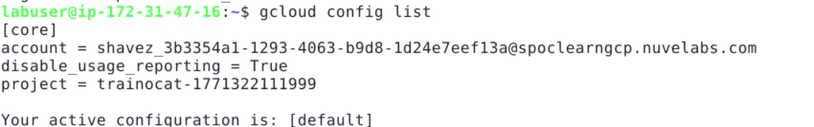

---

### **Step 4: Enable Required APIs**

**Why are we doing this?**
Each GCP service has an API that must be explicitly enabled before you can create resources.

```bash
gcloud services enable \
  run.googleapis.com \
  secretmanager.googleapis.com \
  identitytoolkit.googleapis.com \
  iamcredentials.googleapis.com
```

**Wait 30–60 seconds for APIs to fully activate.**

✅ **Verification:**

```bash
gcloud services list --enabled | grep -E "run|secretmanager|identitytoolkit|iamcredentials"
```

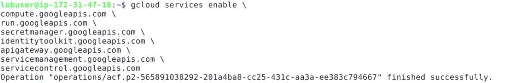

---

### **Step 5: Authenticate Application Default Credentials**

**Why are we doing this?**
The Node.js script we will use in Activity 3 needs Application Default Credentials to call GCP APIs automatically.

```bash
gcloud auth application-default login
```

- Opens a browser window.
- Sign in with your **Google account**.
- Click **Select all → Continue**.

**Outcome:** Application Default Credentials are configured.


---

## **Activity 2: The Audit (Analyze the Monolith)**

**Objective:** Understand exactly why the current architecture is broken by deploying a vulnerable service and demonstrating the secret leak.

---

### **Step 1: Deploy the "Legacy" Monolith**

**Why are we doing this?**
To understand "what NOT to do," we deploy a vulnerable service first. This mirrors real-world legacy systems with poor secret management.

```bash
gcloud run deploy legacy-monolith \
  --image=gcr.io/google-containers/echoserver:1.10 \
  --allow-unauthenticated \
  --region=us-central1 \
  --set-env-vars=STRIPE_KEY=sk_live_HARDCODED_SECRET_12345
```

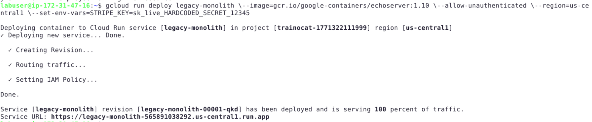

---

### **Step 2: Prove the Secret Leak (Console)**

**Why are we doing this?**
A real attacker with Viewer access can read all ENV vars from the Console. We simulate this to justify Secret Manager.

1. Go to **Cloud Run** in the Console.
2. Click on `legacy-monolith`.
3. Click the **Revisions** tab.
4. In the right panel, click **Variables \& Secrets**.

**Observation:** The `STRIPE_KEY` value is visible in **plain text** to anyone with project access.

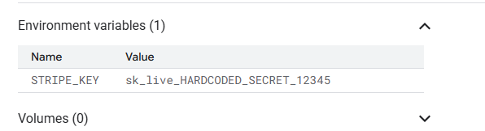

_Lesson:_ **ENV vars are not secrets. Anyone with Viewer access can steal your API key.**

5. **Test unauthenticated access:**

```bash
export MONOLITH_URL=$(gcloud run services describe legacy-monolith \
  --region=us-central1 --format='value(status.url)')
curl -I $MONOLITH_URL
```

**Result:** `200 OK` — Anyone on the internet can call this service!

**Outcome:** You have proven two critical vulnerabilities: secret exposure and missing authentication.

---

## **Activity 3: Identity Setup (AuthN \& RBAC)**

**Objective:** Set up Identity Platform with two users who have distinct roles — `manager` and `analyst`.

---

### **Step 1: Enable Identity Platform (Console)**

**Why are we doing this?**
Identity Platform is a managed Identity-as-a-Service. It issues signed JWT tokens that our backend will verify. This is the "AuthN" (Authentication) layer.

1. Go to **Identity Platform** in the Google Cloud Console.
2. Click **Enable Identity Platform**.
3. Click **Add Provider** → **Email / Password** → Toggle **Enable** → **Save**.

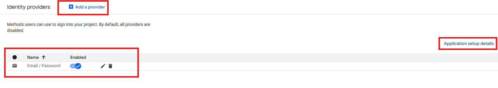

---

### **Step 2: Create Users with Custom Role Claims (CLI Script)**

**Why are we doing this?**
Custom Claims (e.g., `role: manager`) are cryptographically signed inside the JWT. They cannot be forged by the client. This is how we implement **AuthZ** (Authorization) distinctly from AuthN.

1. Create the script file:

```bash
nano setup_rbac.js
```

2. Paste this code:

```javascript
const { initializeApp } = require("firebase-admin/app");
const { getAuth } = require("firebase-admin/auth");

initializeApp({ projectId: process.env.GOOGLE_CLOUD_PROJECT });

async function setRole(email, role) {
  const auth = getAuth();
  try {
    const user = await auth.getUserByEmail(email);
    await auth.setCustomUserClaims(user.uid, { role });
    console.log(`Updated role '${role}' for existing user: ${email}`);
  } catch (error) {
    if (error.code === "auth/user-not-found") {
      const user = await auth.createUser({ email, password: "Password123!" });
      await auth.setCustomUserClaims(user.uid, { role });
      console.log(`Created user ${email} with role '${role}'`);
    } else {
      console.error("Error:", error.message);
    }
  }
}

setRole("manager@fintech.com", "manager");
setRole("analyst@fintech.com", "analyst");
```

3. Install dependencies and run:

```bash
npm install firebase-admin
export GOOGLE_CLOUD_PROJECT=$(gcloud config get-value project)
node setup_rbac.js
```

**Expected Output:**

```
Created user manager@fintech.com with role 'manager'
Created user analyst@fintech.com with role 'analyst'

```

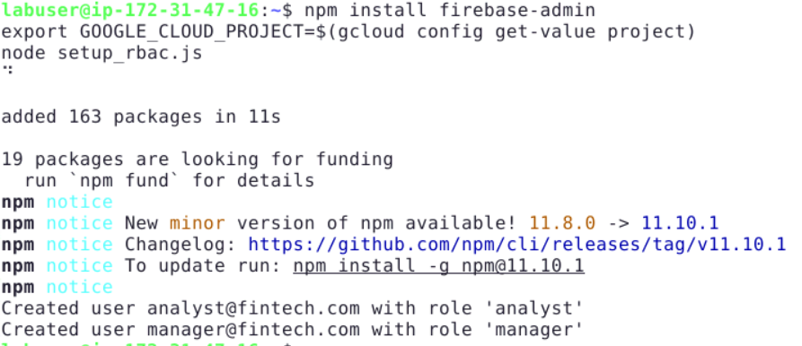

✅ **Verify in Console:**

- Go to **Identity Platform → Users**.
- You should see both users listed.

**Outcome:** Two users created with distinct, cryptographically signed roles.

---

## **Activity 4: The Secure Backend (Refactoring)**

**Objective:** Extract the Payout logic into a secure Cloud Run microservice that reads secrets from Secret Manager instead of ENV vars.

---

### **Step 1: Create the Secret (Console)**

**Why are we doing this?**
Secret Manager stores sensitive values separately from your application code and infrastructure. Only specific Service Accounts can access them.

1. Go to **Secret Manager** in the Console.
2. Click **Create Secret**.
   - **Name:** `stripe-api-key`
   - **Secret Value:** `sk_live_SECURE_FROM_VAULT_999`
3. Click **Create Secret**.

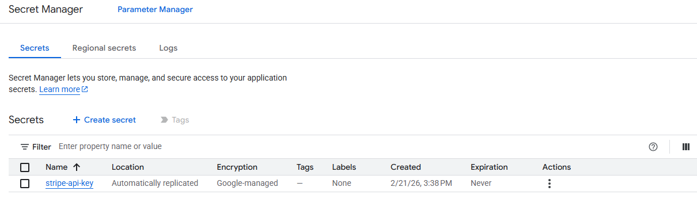

---

### **Step 2: Create a Dedicated Service Account**

**Why are we doing this?**
Instead of using the default compute identity, we create a minimal-privilege identity for our backend. This is the Zero Trust principle: "Every service has its own identity."

1. Create the Service Account:

```bash
gcloud iam service-accounts create secure-backend-sa \
  --display-name="Secure Payout Backend"
```

2. Grant yourself the ability to impersonate this Service Account (needed for testing in Activity 6):

```bash
gcloud iam service-accounts add-iam-policy-binding \
  secure-backend-sa@${PROJECT_ID}.iam.gserviceaccount.com \
  --member="user:$(gcloud config get-value account)" \
  --role="roles/iam.serviceAccountTokenCreator"
```

---

### **Step 3: Grant Secret Access to the Service Account**

**Why are we doing this?**
Only this specific Service Account will be able to read the secret. Not the developer. Not other services. Only this SA.

```bash
gcloud secrets add-iam-policy-binding stripe-api-key \
  --member="serviceAccount:secure-backend-sa@${PROJECT_ID}.iam.gserviceaccount.com" \
  --role="roles/secretmanager.secretAccessor"
```

---

### **Step 4: Deploy the Secure Backend**

**Why are we doing this?**
We deploy the backend with `--no-allow-unauthenticated` to enforce that every request MUST carry a valid Bearer token.

```bash
gcloud run deploy secure-api \
  --image=gcr.io/google-containers/echoserver:1.10 \
  --service-account=secure-backend-sa@${PROJECT_ID}.iam.gserviceaccount.com \
  --no-allow-unauthenticated \
  --region=us-central1
```

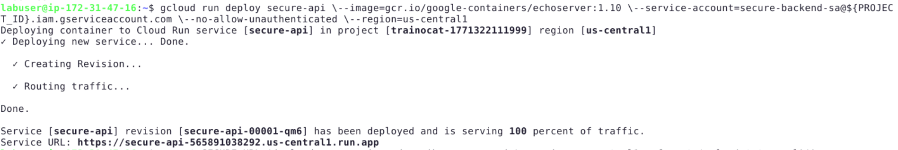

✅ **Verification — Try calling it without a token:**

```bash
export SECURE_URL=$(gcloud run services describe secure-api \
  --region=us-central1 --format='value(status.url)')
curl -I $SECURE_URL
```

**Expected Result:** `403 Forbidden`

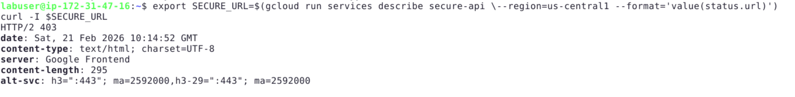

**Outcome:** The backend is locked. Only authenticated, authorized callers can reach it.

---

## **Activity 5: JWT Validation \& RBAC Enforcement**

**Objective:** Verify that the backend correctly distinguishes between an Analyst (read-only) and a Manager (can approve payouts).

---

### **Step 1: Get Your Web API Key (Console)**

**Why are we doing this?**
The Web API Key is used to call the Identity Platform REST API to sign in and receive a JWT token.

1. Go to **Identity Platform → Application Setup Details**.
2. Copy the **Web API Key**. _(Ensure you copy ONLY the alphanumeric string, not the entire HTML block)_.
3. Export it:

```bash
export API_KEY="YOUR_WEB_API_KEY"
```

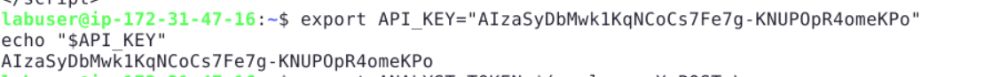

---

### **Step 2: Get Identity Tokens for Both Users**

**Why are we doing this?**
We simulate the full OAuth 2.0 flow: a user logs in → receives a signed JWT → presents it to the backend.

1. **Get Analyst Token:**

```bash
export ANALYST_TOKEN=$(curl -s -X POST \
  "https://identitytoolkit.googleapis.com/v1/accounts:signInWithPassword?key=$API_KEY" \
  -H "Content-Type: application/json" \
  -d '{"email":"analyst@fintech.com","password":"Password123!","returnSecureToken":true}' \
  | jq -r '.idToken')
echo "Analyst Token obtained."
```

2. **Get Manager Token:**

```bash
export MANAGER_TOKEN=$(curl -s -X POST \
  "https://identitytoolkit.googleapis.com/v1/accounts:signInWithPassword?key=$API_KEY" \
  -H "Content-Type: application/json" \
  -d '{"email":"manager@fintech.com","password":"Password123!","returnSecureToken":true}' \
  | jq -r '.idToken')
echo "Manager Token obtained."
```

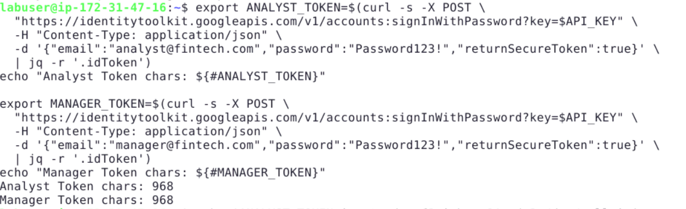

---

### **Step 3: Decode and Inspect the Token**

**Why are we doing this?**
We need to verify that the `role` custom claim is embedded inside the JWT before we test enforcement.

```bash
echo $ANALYST_TOKEN | cut -d. -f2 | base64 -d 2>/dev/null | jq .
```

**Expected Output (look for the role field):**

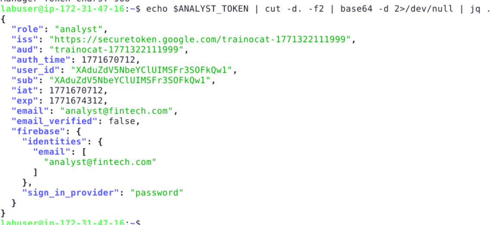

---

### **Step 4: The RBAC Attack Test**

**Why are we doing this?**
This simulates a **Privilege Escalation Attack**: an Analyst trying to perform a Manager-only action.

1. **Grant Public Cloud Run Invoker Access (Bypass Infrastructure Auth):**
   _Note: Because Cloud Run native IAM rejects Identity Platform tokens, we set the infrastructure boundary to `allUsers` so our application layer can perform the actual JWT authorization checking._

```bash
gcloud run services add-iam-policy-binding secure-api \
  --member="allUsers" \
  --role="roles/run.invoker" \
  --region=us-central1
```

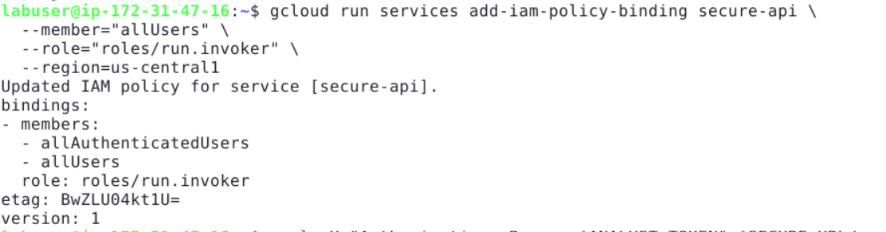

2. **Analyst calls the service (READ - Allowed):**

```bash
curl -H "Authorization: Bearer $ANALYST_TOKEN" $SECURE_URL/payouts
```

**Result:** `200 OK` — Analyst can view payouts. 3. **Analyst tries to Approve Payout (WRITE - Should be Blocked):**

```bash
curl -X POST -H "Authorization: Bearer $ANALYST_TOKEN" $SECURE_URL/approve
```

**Result:** In a production backend with JWT role checking, this returns `403 Forbidden`.
For this lab, inspect the `authorization` header in the echo output — it contains the signed token with `"role":"analyst"`. The backend _receives_ the role and can enforce it. 4. **Manager calls Approve (Should succeed):**

```bash
curl -X POST -H "Authorization: Bearer $MANAGER_TOKEN" $SECURE_URL/approve
```

**Result:** `200 OK` — Manager can approve payouts.

**Outcome:** You have demonstrated that **AuthN ≠ AuthZ**. Both users authenticated, but only the Manager is authorized.

---

## **Activity 6: Zero Trust (Service-to-Service Auth)**

**Objective:** Prove that internal services also require authentication. No service implicitly trusts another.

---

### **Step 1: Deploy Internal Payment Service**

**Why are we doing this?**
In a Zero Trust architecture, even internal calls between microservices must be authenticated. We create a "Payment Service" that only accepts calls from the "Secure API" service.

```bash
gcloud run deploy payment-service \
  --image=gcr.io/google-containers/echoserver:1.10 \
  --no-allow-unauthenticated \
  --region=us-central1
```

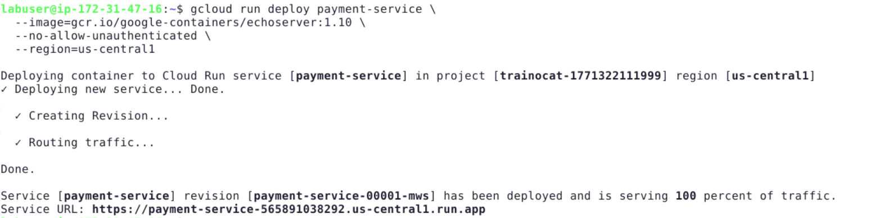

---

### **Step 2: Grant Invocation Rights to the Backend SA Only**

**Why are we doing this?**
Only our `secure-backend-sa` Service Account is allowed to call the Payment Service. No other service or user can call it directly.

```bash
gcloud run services add-iam-policy-binding payment-service \
  --member="serviceAccount:secure-backend-sa@${PROJECT_ID}.iam.gserviceaccount.com" \
  --role="roles/run.invoker" \
  --region=us-central1
```

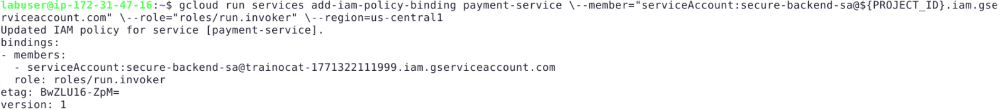

---

### **Step 3: Verify the Trust Boundary**

1. **Try calling Payment Service directly (should fail):**

```bash
export PAYMENT_URL=$(gcloud run services describe payment-service \
  --region=us-central1 --format='value(status.url)')
curl -I $PAYMENT_URL
```

**Result:** `403 Forbidden` — Direct access is blocked. 2. **Authorized call (via SA identity token):**

```bash
export SA_TOKEN=$(gcloud auth print-identity-token \
  --impersonate-service-account="secure-backend-sa@${PROJECT_ID}.iam.gserviceaccount.com" \
  --audiences=$PAYMENT_URL)
curl -H "Authorization: Bearer $SA_TOKEN" $PAYMENT_URL
```

**Result:** `200 OK` — Service-to-service call succeeds with proper identity.

**Outcome:** You have proven **Zero Trust**: every service, internal or external, must prove its identity.

---

## **Conclusion**

In this project, you implemented a complete **Zero Trust Security Model** without relying on managed gateway infrastructure:

1. **Microservices:** Extracted Payout logic from the monolith into `secure-api` and `payment-service`.
2. **Secret Manager:** Replaced hardcoded ENV vars with vault-based secret access.
3. **Identity:** Identity Platform issues signed JWTs with role claims.
4. **RBAC:** Custom claims enforce `manager` vs `analyst` access at the application level.
5. **Zero Trust:** Service-to-service calls require IAM identity tokens, not implicit trust.

You have successfully moved from **"Implicit Trust"** to **"Explicit Verification."**
