# **API Management & API Platform Migration**

## **Overview**

In this guided project, you will act as a **Cloud Solution Architect** for **GlobalTech**, an enterprise heavily relying on a fragmented mix of legacy API gateways like Kong and AWS API Gateway. To enforce consistent governance, security, and lifecycle management across all their services, migrating to a centralized, enterprise-grade platform like Google Cloud Apigee X is essential.

Your mission is to architect and execute a zero-downtime migration to Apigee. You will deploy legacy and modern backend microservices, provision a secure Apigee runtime environment, and build API Proxies that enforce strict Zero Trust governance using API Keys and distributed Quotas. Finally, you will implement a Strangler Fig routing pattern to modernize the backend without disrupting existing clients, culminating in a detailed Migration Blueprint for enterprise leadership.

---

## **Scenario**

**GlobalTech** has acquired multiple smaller companies, leaving their backend APIs scattered across inconsistent gateway platforms with differing security standards.

**The Current State (Fragmented):**

- **Inconsistent Platforms:** APIs are managed across a mix of Kong and AWS API Gateway.
- **Fragmented Governance:** Rate limiting and API Key validations are handled differently per gateway.
- **Monolithic Upstreams:** Legacy APIs are tightly coupled and difficult to upgrade safely.

**The Target State (Centralized):**

- **Unified Platform:** Google Cloud Apigee X acts as the single enterprise gateway.
- **Global Governance:** Strict Quota enforcement and centralized API Key validation applied to all consumers.
- **Strangler Fig Migration:** New microservice functionality is dynamically routed via Apigee, allowing legacy monolithic code to be safely "strangled" out over time.

---

## **What You Will Learn**

By completing this project, you will learn how to:

- Prepare Google Cloud VPC networking, firewalls, and IP allocations for complex Service Networking peering.
- Provision and configure a complete Apigee X Evaluation runtime environment.
- Package, secure, and deploy Apigee API Proxies via the command line using the Apigee Management API.
- Enforce strict API Lifecycle & Governance using API Keys and globally synchronized rate-limiting Quotas.
- Implement API versioning and backward compatibility using a Strangler Fig routing strategy.
- Author an executive-level Migration Blueprint defining the transition strategy, architectural placement, and risk mitigations.

---

## **Prerequisites**

- A Google Cloud account with project-level `Editor` or `Owner` access.
- Access to a Linux VM terminal with `gcloud` pre-installed (provided in the lab environment).
- Editor access to the Google Cloud Console.
- Basic understanding of API gateways, RESTful APIs, XML formatting, and JSON validation.

---

## **Skill Tags**

`Apigee X` `API Management` `API Lifecycle & Governance` `Cloud Run` `API Migration` `Kong` `AWS API Gateway` `Strangler Fig Pattern` `API Versioning` `Zero-Downtime Deployment` `VPC Peering`

---

## **Milestones**

- **Environment Setup:** Authenticate the CLI, install system dependencies, and enable required Google Cloud APIs.
- **Infrastructure Prep:** Recreate the VPC network, configure firewalls, and provision the Apigee runtime.
- **Backend Mocking:** Deploy legacy and modern mock backend services using Cloud Run.
- **Governance:** Build and deploy an Apigee API Proxy incorporating strict security and rate-limiting policies.
- **Lifecycle Management:** Register Developer Apps and automate credential extraction.
- **Zero-Downtime Routing:** Configure version-based routing for a Strangler Fig migration and execute live `curl` tests to prove dynamic routing.
- **Capstone:** Generate the API Platform Migration Blueprint Capstone document.

---

## **What You Will Do**

- Authenticate the CLI and install parsing utilities like `jq` and `zip`.
- Create a VPC network, allocate massive `/20` IP ranges, and establish Private Service Connect VPC peering.
- Use the Google Cloud Console to provision an Apigee evaluation organization and configure an external Application Load Balancer with wildcard DNS.
- Deploy a monolithic (`v1`) and microservice (`v2`) Customer API on Cloud Run.
- Create an Apigee Proxy XML bundle that includes a `VerifyAPIKey` policy and a highly strict, globally distributed `Quota` policy.
- Use the Apigee Management API to script the creation of API Products, Developers, and Apps.
- Update your proxy with a `RouteRule` to seamlessly redirect traffic to the `v2` microservice without breaking legacy `v1` clients.
- Run intense `curl` loops against the Apigee gateway to verify the exact moment the rate-limiting Quota blocks requests.

---

## **What You Will Be Provided**

- A pre-provisioned Google Cloud Project.
- Console access with Editor/Owner permissions.
- Access to a Linux VM with a terminal and necessary tools pre-installed.
- Step-by-step guidance for network configuration, XML policy authoring, and API testing.

---

## Activities

### **Activity 1: Environment Setup**

Before starting the project, you need to prepare your Google Cloud environment. This involves setting up the correct project context, installing required parsing tools, and enabling the necessary services.

#### **Step 1: Authenticate and Configure Your Active Project**

**Why are we doing this?**
You must ensure you are working in the correct GCP project. The `gcloud` CLI needs to authenticate with your Google account and target the assigned project.

1. **Verify Project:** Open the **Google Cloud Console** in your browser. Look at the top navigation bar. Ensure the **project dropdown** shows the **Project ID** assigned to you for this lab. Copy the **Project ID** from **Cloud overview → Dashboard** for later use.


2. **Open Terminal:** On your provided VM desktop, click the **Terminal Emulator** icon. This terminal will be used to run all commands in this lab.

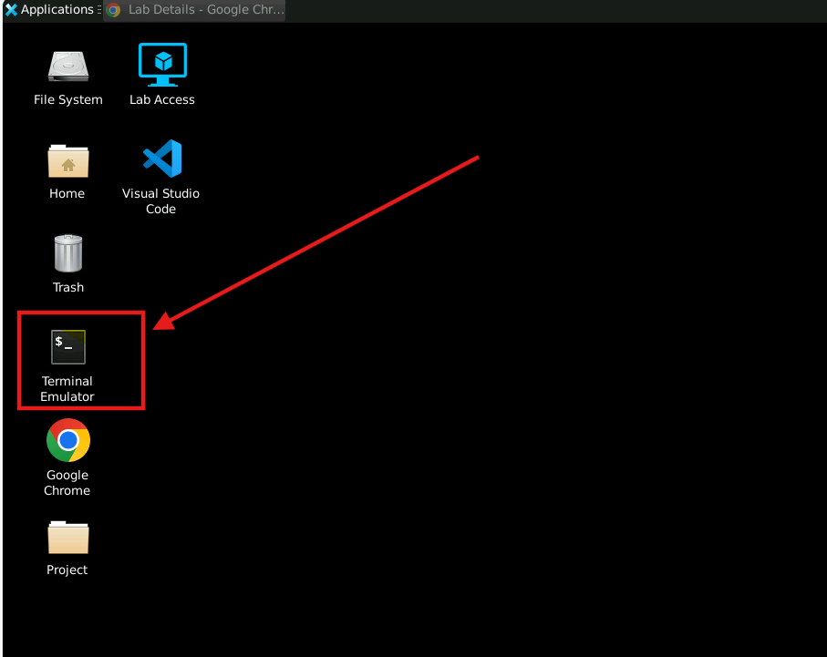

3. **Authenticate:** Run the following command in the terminal to authenticate:

```bash
gcloud auth login
```

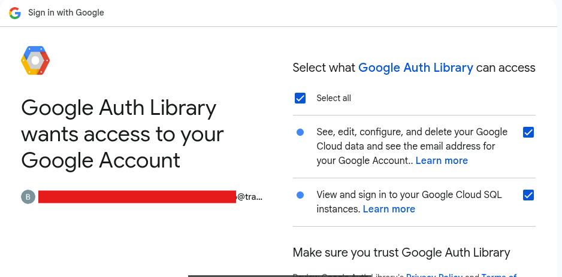

_(This will open a browser window. Sign in with your Google account, click **Continue**, and select **Allow**)._

4. **Set Project Variable:** Export your Project ID as an environment variable and set it as the active project for `gcloud`:

```bash
export PROJECT_ID=$(gcloud config get-value project)
```

_(Note: If the `export` command fails to grab the project, you can set it manually using the Project ID you copied from the console):_

```bash
gcloud config set project [YOUR_PROJECT_ID]
```

#### **Step 2: Install System Dependencies (`jq` and `zip`)**

**Why are we doing this?**
We need a command-line tool called `jq` to easily parse JSON responses (like extracting API Keys) from Google APIs later in the lab, and `zip` to package our Apigee proxy bundles.

Run the following commands to update package lists and install `jq` and `zip`:

```bash
sudo apt-get update && sudo apt-get install jq -y
sudo apt install zip
```

#### **Step 3: Enable Required Google Cloud APIs**

**Why are we doing this?**
Google Cloud services must be explicitly enabled before you can use them. We need APIs for Cloud Run, Compute Engine, Service Networking (for VPC Peering), and Apigee.

Run the following command:

```bash
gcloud services enable \
  run.googleapis.com \
  compute.googleapis.com \
  servicenetworking.googleapis.com \
  apigee.googleapis.com
```

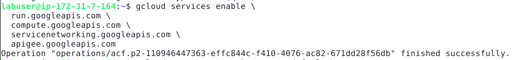

### Activity 2: Network Preparation \& Apigee Provisioning

**Why are we doing this?**
Lab environments often come with empty networks and strict CLI quota limits. To deploy Apigee X, we must explicitly create a VPC network, allocate an IP range, and then use the Google Cloud Console to establish VPC peering and provision the Apigee runtime.

1. **Recreate the default VPC Network and Firewall Rules:**
   _(Note: If you receive an error saying the network or firewall "already exists," you can safely ignore it and proceed to step 2. This just means your lab environment was already pre-configured)._

```bash
gcloud compute networks create default \
  --subnet-mode=auto \
  --bgp-routing-mode=regional \
  --mtu=1460
```

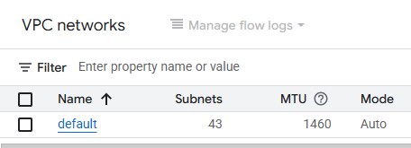

```bash
gcloud compute firewall-rules create default-allow-internal \
  --network default \
  --allow tcp,udp,icmp \
  --source-ranges 10.128.0.0/9

gcloud compute firewall-rules create default-allow-ssh \
  --network default \
  --allow tcp:22 \
  --source-ranges 0.0.0.0/0
```

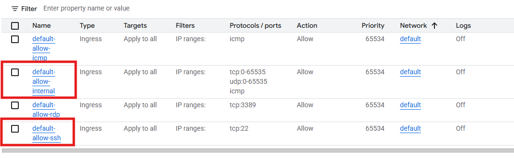

2. **Allocate an IP range for Apigee Service Networking:**
   _(Note: We allocate a large /20 range to prevent IP exhaustion errors during provisioning)._

```bash
gcloud compute addresses create apigee-range \
  --global \
  --purpose=VPC_PEERING \
  --addresses=10.0.0.0 \
  --prefix-length=22 \
  --network=default
```

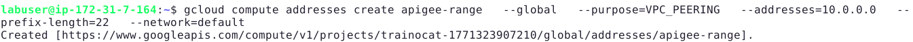

3. **Create the VPC Peering manually in the Console:**

- Open the **Google Cloud Console** in your browser.
- In the top search bar, type **VPC networks** and click on it.
- Click on your **`default`** network from the list.
- Click on the **Private service connection** tab (near the top).
- Click on the **Private connections to services** tab.
- Click the **Create Connection** button. - Fill in the details:
  _ **Network:** `default`
  _ **Service provider:** Select `Google Cloud`
  _ **Assigned allocation:** Select the `apigee-range` that you created earlier. - Click **Connect**.
  _(Wait about 1 minute for the spinning circle to finish and show "Connected").\*

  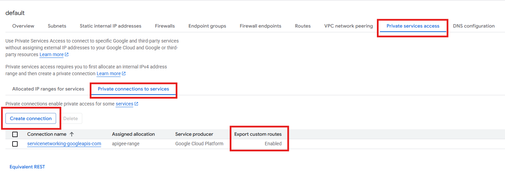

4.  **Provision Apigee via the Console Wizard:**

    Now that the network is peered, let's provision Apigee through the UI to ensure no more CLI errors:
    - In the top search bar, type **Apigee** and click on it.
    - On the Welcome screen, scroll to the bottom and click the link that says: **"Or try Apigee for free in your own sandbox for 60 days."**
      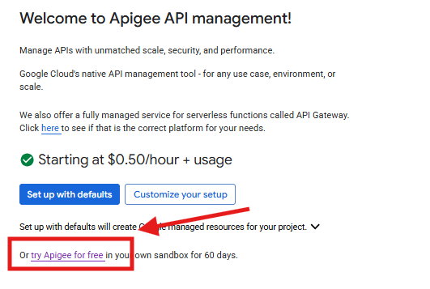

    - **Step 1 (Enable APIs):** These should already be checked as enabled.

      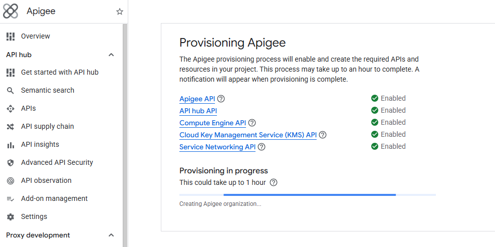

    - **Step 2 (Networking):** Click **Edit**, select the `default` network you just peered, and click **Connect**.
      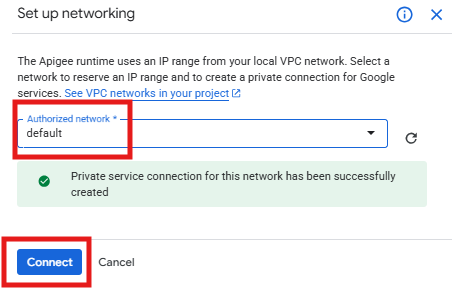

    - **Step 3 (Apigee evaluation organization):** Click **Edit**.
      For Analytics hosting region, select `us-central1`. For Runtime location, select `us-central1` (or a zone like `us-central1-a`). Click **Provision**.
      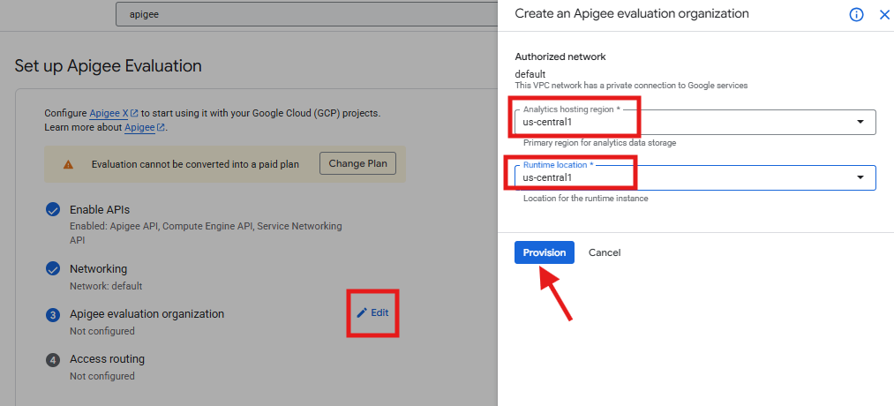

    _(This will kick off the 40-minute deployment process directly in the Google Cloud background, completely bypassing any gcloud terminal quota limits)._

5.  **Configure Access Routing:**

    The final step in the wizard is Access routing. This step tells Apigee how to expose the APIs you build to the outside world. Here is exactly what to do to finish the setup:
    - Click on the **Edit** pencil icon next to **Access routing** (Step 4).
    - A panel will open on the right side. Select **Enable internet access** (this allows you to test your APIs using `curl` from your VM terminal).
    - Under Domain Type, select **Automatically managed domain, subnetwork and SSL certificates**. Ensure **Use wildcard DNS service** (example: nip.io) is selected so Google automatically creates a domain for you without needing to buy a real one.
    - Ensure the **Subnetwork** is set to `default`.
    - Click the blue **Set access** button.

    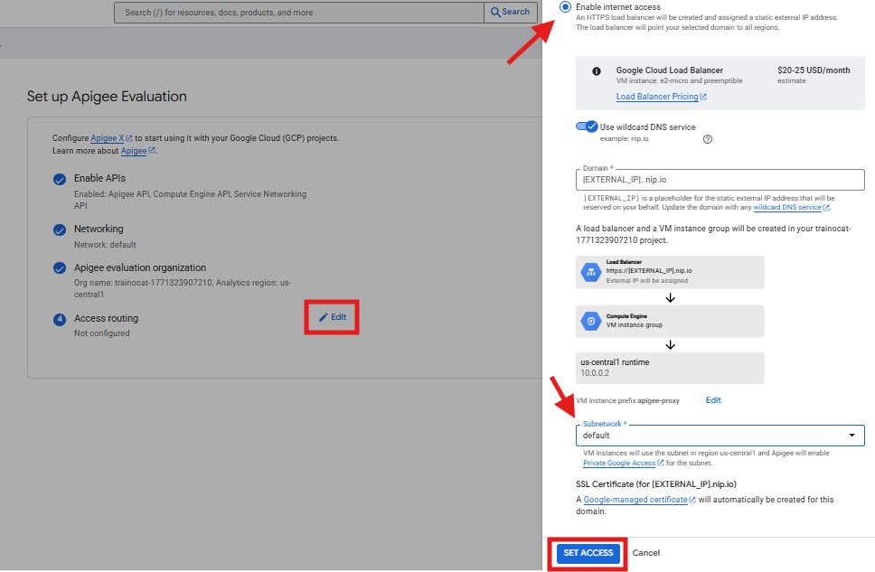

_(Note: You do not need to wait for the provisioning to finish! Leave the browser tab open and immediately proceed to Activity 3 in your terminal)._

### Activity 3: Deploy Upstream Backend Services

**Why are we doing this?**
To simulate the legacy APIs currently behind Kong/AWS API Gateway, we will deploy a `v1` backend, alongside a new `v2` backend using Cloud Run.

1. **Deploy the legacy (v1) and modern (v2) backend services:**

```bash
# Simulates the legacy monolithic backend currently behind Kong/AWS
gcloud run deploy customer-api-v1 \
  --image=gcr.io/google-containers/echoserver:1.10 \
  --region=us-central1 \
  --allow-unauthenticated

# Simulates the new, refactored microservice
gcloud run deploy customer-api-v2 \
  --image=gcr.io/google-containers/echoserver:1.10 \
  --region=us-central1 \
  --allow-unauthenticated
```

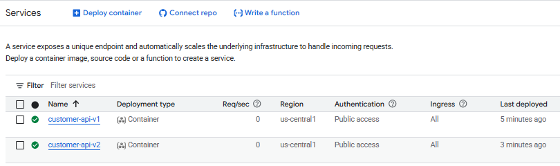

### Activity 4: Build the Apigee Proxy with Security Governance

**Why are we doing this?**
In Apigee architecture, the API Proxy acts as the enforcement point for governance. We will create a local proxy bundle with a `VerifyAPIKey` policy and a globally distributed `Quota` policy to prevent rate-limit abuse.

1. **Create the Proxy directory structure:**

```bash
mkdir -p apiproxy/proxies apiproxy/targets apiproxy/policies
```

2. **Create the Governance Policies (API Key and Quota):**

```bash
# Verify API Key Policy
cat << 'EOF' > apiproxy/policies/Verify-API-Key.xml
<VerifyAPIKey async="false" continueOnError="false" enabled="true" name="Verify-API-Key">
    <DisplayName>Verify API Key</DisplayName>
    <APIKey ref="request.header.x-api-key"/>
</VerifyAPIKey>
EOF

# Strict Quota Policy (5 calls per minute, distributed)
cat << 'EOF' > apiproxy/policies/Enforce-Quota.xml
<Quota async="false" continueOnError="false" enabled="true" name="Enforce-Quota">
    <DisplayName>Enforce Quota</DisplayName>
    <Properties/>
    <Allow count="5"/>
    <Interval>1</Interval>
    <TimeUnit>minute</TimeUnit>
    <Identifier ref="request.header.x-api-key"/>
    <Distributed>true</Distributed>
    <Synchronous>true</Synchronous>
</Quota>
EOF
```

3. **Configure the Endpoints and Root XML:**

````bash
export V1_URL=$(gcloud run services describe customer-api-v1 --region=us-central1 --format='value(status.url)')

cat << 'EOF' > apiproxy/proxies/default.xml
<ProxyEndpoint name="default">
    <PreFlow name="PreFlow">
        <Request>
            ```
            <Step><Name>Verify-API-Key</Name></Step>
            ```
            ```
            <Step><Name>Enforce-Quota</Name></Step>
            ```
        </Request>
    </PreFlow>
    <HTTPProxyConnection>
        <BasePath>/customers</BasePath>
    </HTTPProxyConnection>
    <RouteRule name="default">
        <TargetEndpoint>default</TargetEndpoint>
    </RouteRule>
</ProxyEndpoint>
EOF

cat << EOF > apiproxy/targets/default.xml
<TargetEndpoint name="default">
    <HTTPTargetConnection>
        <URL>$V1_URL</URL>
    </HTTPTargetConnection>
</TargetEndpoint>
EOF

cat << 'EOF' > apiproxy/Customer-API.xml
<APIProxy revision="1" name="Customer-API">
    <Basepaths>/customers</Basepaths>
    <Policies>
        ```
        <Policy>Verify-API-Key</Policy>
        ```
        ```
        <Policy>Enforce-Quota</Policy>
        ```
    </Policies>
    <ProxyEndpoints>
        <ProxyEndpoint>default</ProxyEndpoint>
    </ProxyEndpoints>
    <TargetEndpoints>
        <TargetEndpoint>default</TargetEndpoint>
    </TargetEndpoints>
</APIProxy>
EOF
````

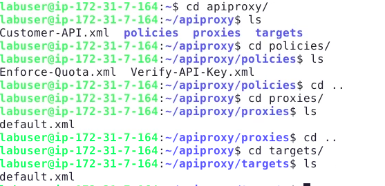

_(Note: Wait until your Cloud Console indicates that Apigee Provisioning is 100% complete before running the next step)._

4. **Ensure variables are fresh and deploy Revision 1:**
   Since Apigee takes time to provision, ensure your terminal tokens haven't expired.

```bash
export PROJECT_ID=$(gcloud config get-value project)
export TOKEN=$(gcloud auth print-access-token)
export ENV_NAME="eval"

zip -r proxy.zip apiproxy

# Upload the Proxy
curl -q -s -X POST -H "Authorization: Bearer $TOKEN" \
  -H "Content-Type: multipart/form-data" \
  -F "file=@proxy.zip" \
  "https://apigee.googleapis.com/v1/organizations/$PROJECT_ID/apis?name=Customer-API&action=import"

# Deploy Revision 1
curl -q -s -X POST -H "Authorization: Bearer $TOKEN" \
  "https://apigee.googleapis.com/v1/organizations/$PROJECT_ID/environments/$ENV_NAME/apis/Customer-API/revisions/1/deployments"
```

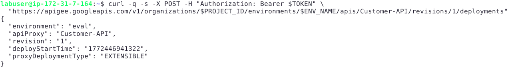

_(If it succeeds, it will print out a JSON response showing the proxy details like `name: Customer-API`, `revision: 1`)._

### Activity 5: Configure API Developer Lifecycle \& Strangler Fig Routing

**Why are we doing this?**
To map clients from AWS/Kong, you must create API Products, register Developers, and extract an App API Key. Then, we will configure Strangler Fig routing to redirect new functionality to `v2` without breaking the `v1` legacy path.

1. **Create the Product, Developer, and App:**

```bash
curl -s -X POST -H "Authorization: Bearer $TOKEN" -H "Content-Type: application/json" \
  "https://apigee.googleapis.com/v1/organizations/$PROJECT_ID/apiproducts" -d '{
    "name": "CustomerProduct",
    "displayName": "Enterprise Customer API Product",
    "approvalType": "auto",
    "environments": ["'$ENV_NAME'"],
    "proxies": ["Customer-API"]
}'

curl -s -X POST -H "Authorization: Bearer $TOKEN" -H "Content-Type: application/json" \
  "https://apigee.googleapis.com/v1/organizations/$PROJECT_ID/developers" -d '{
    "email": "migration-team@globaltech.com",
    "firstName": "Migration",
    "lastName": "Admin",
    "userName": "migrationadmin"
}'

curl -s -X POST -H "Authorization: Bearer $TOKEN" -H "Content-Type: application/json" \
  "https://apigee.googleapis.com/v1/organizations/$PROJECT_ID/developers/migration-team@globaltech.com/apps" -d '{
    "name": "Legacy-Consumer-App",
    "apiProducts": ["CustomerProduct"]
}'
```

2. **Extract your Consumer API Key:**

```bash
export API_KEY=$(curl -s -H "Authorization: Bearer $TOKEN" \
  "https://apigee.googleapis.com/v1/organizations/$PROJECT_ID/developers/migration-team@globaltech.com/apps/Legacy-Consumer-App" | jq -r '.credentials.consumerKey')

echo "Your App API Key is: $API_KEY"
```

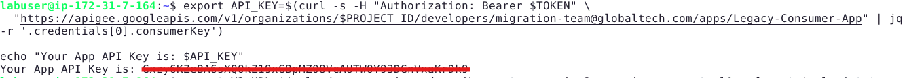

3. **Apply Strangler Fig Routing to the Proxy:**

````bash
export V2_URL=$(gcloud run services describe customer-api-v2 --region=us-central1 --format='value(status.url)')

cat << EOF > apiproxy/targets/v2.xml
<TargetEndpoint name="v2">
    <HTTPTargetConnection>
        <URL>$V2_URL</URL>
    </HTTPTargetConnection>
</TargetEndpoint>
EOF

cat << 'EOF' > apiproxy/proxies/default.xml
<ProxyEndpoint name="default">
    <PreFlow name="PreFlow">
        <Request>
            ```
            <Step><Name>Verify-API-Key</Name></Step>
            ```
            ```
            <Step><Name>Enforce-Quota</Name></Step>
            ```
        </Request>
    </PreFlow>
    <HTTPProxyConnection>
        <BasePath>/customers</BasePath>
    </HTTPProxyConnection>

    <!-- Strangler Fig Routing: Route /v2 to the new backend -->
    <RouteRule name="v2-route">
        <Condition>(proxy.pathsuffix MatchesPath "/v2")</Condition>
        <TargetEndpoint>v2</TargetEndpoint>
    </RouteRule>

    <!-- Legacy Default Routing -->
    <RouteRule name="default">
        <TargetEndpoint>default</TargetEndpoint>
    </RouteRule>
</ProxyEndpoint>
EOF

sed -i 's|</TargetEndpoints>|    <TargetEndpoint>v2</TargetEndpoint>\n    </TargetEndpoints>|g' apiproxy/Customer-API.xml
````

4. **Package and Deploy Revision 2 with Override Flag:**
   To achieve the "Zero-Downtime" deployment we promised the client, you must add `?override=true` to the end of the deployment URL. This securely replaces Revision 1.

```bash
zip -r proxy-v2.zip apiproxy

# Upload Revision 2
curl -q -s -X POST -H "Authorization: Bearer $TOKEN" \
  -H "Content-Type: multipart/form-data" \
  -F "file=@proxy-v2.zip" \
  "https://apigee.googleapis.com/v1/organizations/$PROJECT_ID/apis?name=Customer-API&action=import"

# Deploy Revision 2 (Zero-Downtime Swap)
curl -q -s -X POST -H "Authorization: Bearer $TOKEN" \
  "https://apigee.googleapis.com/v1/organizations/$PROJECT_ID/environments/$ENV_NAME/apis/Customer-API/revisions/2/deployments?override=true"
```

_(Wait 30-60 seconds for Apigee to fully propagate the new routing logic before testing)._

### Activity 6: Test Zero-Trust Governance and Strangler Fig Routing

**Why are we doing this?**
We will extract our public Apigee domain name and use `curl` to prove that API Key enforcement, rate limiting, and Strangler Fig version routing are all functioning correctly.

1. **Get your Apigee Domain Name:**
   - Go to the **Apigee Console > Management > Environments > Groups**.
   - Look under "Hostnames". Copy the hostname (it will look something like `34.111.222.111.nip.io`).
     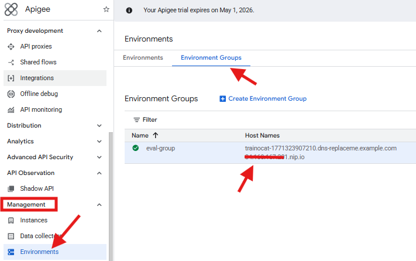

2. **Export the domain to your terminal:**

```bash
export APIGEE_DOMAIN="<PASTE_YOUR_HOSTNAME_HERE>"
```

3. **Test Governance (It should block you):**
   Try calling the API without an API Key. Apigee will protect it!

```bash
curl -i https://$APIGEE_DOMAIN/customers
# Result: 401 Unauthorized (VerifyAPIKey policy is working!)
```

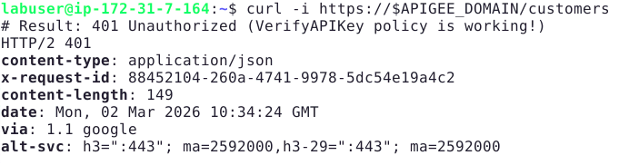

4. **Test Legacy `v1` Access (Success):**
   Pass the API key you generated earlier.

```bash
curl -i -H "x-api-key: $API_KEY" https://$APIGEE_DOMAIN/customers
# Result: 200 OK (It hits the v1 Cloud Run backend)
```

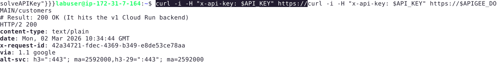

5. **Test Strangler Fig `v2` Routing:**
   Call the `/v2` path. Apigee will dynamically route it to the new microservice!

```bash
curl -i -H "x-api-key: $API_KEY" https://$APIGEE_DOMAIN/customers/v2
# Result: 200 OK (It hits the v2 Cloud Run backend)
```

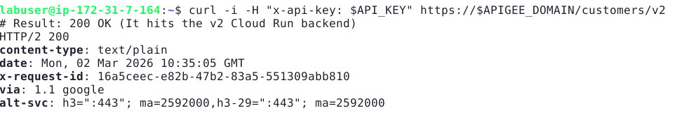

6. **Test the Quota Policy:**
   Run the success command rapidly 6 times in a row. Because we set a Quota of 5 requests per minute, on the 6th try, Apigee will block you with a `429 Too Many Requests` error!

```bash
for i in {1..6}; do curl -i -H "x-api-key: $API_KEY" https://$APIGEE_DOMAIN/customers; echo ""; done
```

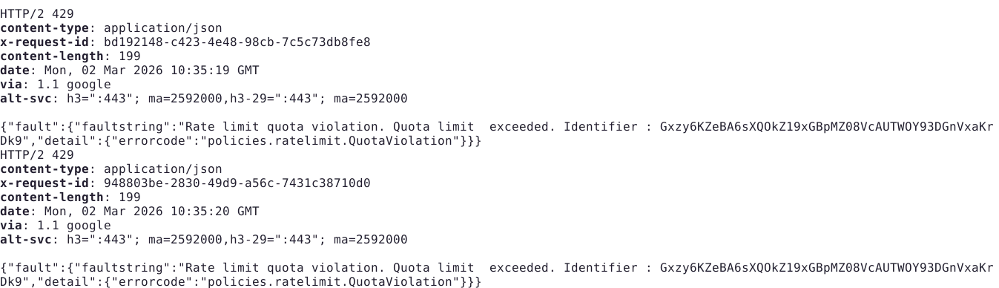

### Activity 7: Create the Capstone Document

**Why are we doing this?**
You need a formal architectural blueprint to present to leadership that outlines the strategy for migrating away from the legacy API platforms (Kong/AWS) securely and without downtime.

1. **Generate the Capstone Blueprint Document:**

```bash
cat << 'EOF' > API-Platform-Migration-Blueprint.md
# API Platform Migration Blueprint: Kong & AWS API Gateway to Apigee

## 1. Migration Strategy from Kong & AWS API Gateway
- **Discovery & Cataloging:** Extract OpenAPI schemas, Lambda custom authorizers (AWS), and custom Lua plugins (Kong).
- **Policy Re-platforming:** Replace Kong rate-limiting and AWS IAM verification with Apigee's native `Quota`, `SpikeArrest`, and `OAuthV2` policies. Complex AWS lambda authorizers can be rewritten using Apigee JavaScript callouts.
- **Consumer Onboarding:** Use the Apigee Management API to script the migration of existing API keys and OAuth client IDs directly into Apigee Developer Apps, ensuring clients do not have to rotate credentials.

## 2. Apigee Architecture & Placement
- **Network Layout:** Apigee X is deployed within a tenant Google-managed VPC peered to the enterprise network. An External Global HTTP(S) Load Balancer is deployed at the edge with Google Cloud Armor for WAF and DDoS protection.
- **Backend Connectivity:** To ensure Zero Trust, upstreams (like Cloud Run or internal Compute Engine VMs) should be accessed privately using Private Service Connect (PSC), completely removing public IP access to backend data.

## 3. Risks & Mitigation
| Risk | Impact | Mitigation |
| :--- | :--- | :--- |
| **Downtime during cutover** | High | Utilize DNS weighting for traffic splitting. Adopt the Strangler Fig pattern for incremental route migration. |
| **Plugin feature parity gaps** | High | Map all legacy plugins to Apigee out-of-the-box policies. Utilize Extension Callouts for custom backend authentication requirements. |
| **Consumer credential loss** | Medium | Maintain a mapping database. Export legacy consumer credentials and explicitly import them as consumer keys during Apigee App creation. |

## 4. Zero-Downtime Migration Approach
We will utilize the **Strangler Fig Pattern** combined with **DNS Weighting** to migrate safely:
1. **Parallel Provisioning:** Deploy fully configured Apigee proxies alongside the existing Kong/AWS Gateways, connecting them to the same backend microservices.
2. **Shadow Traffic:** Mirror a subset of production traffic to Apigee using a sidecar proxy or load balancer to validate latency and policy enforcement without impacting client responses.
3. **Canary Cutover:** Update the Global DNS configuration to route 5% of external traffic to the Apigee Load Balancer.
4. **Monitor & Scale:** Validate error rates and gradually increase the DNS weight (25% → 50% → 100%).
5. **Decommissioning:** Once Apigee successfully handles 100% of the traffic for a full billing cycle, decommission the legacy AWS API Gateways and Kong clusters.
EOF
```

2. **Verify the generated blueprint:**

```bash
cat API-Platform-Migration-Blueprint.md
```

## Conclusion

In this comprehensive guided project, you navigated complex network requirements to provision a full Apigee X Evaluation environment. 

You architected robust API Proxies enforced with API Key identity checks and globally synchronized Quota governance. 

You executed a full API lifecycle by provisioning Products and Developer Apps, and successfully managed legacy backward compatibility using path-based Strangler Fig version routing. 

Finally, you drafted an Enterprise Migration Blueprint defining the exact architectural posture and zero-downtime mechanisms required to transition safely from AWS and Kong gateways to Google Cloud.
