# Guided Project: Migration Architecture

---

# Overview

In this guided project, you will act as a **Cloud Solution Architect** responsible for modernizing legacy enterprise workloads on Google Cloud.

You will migrate a **VM-based application to Cloud Run**, convert an **OpenShift deployment to Google Kubernetes Engine (GKE)**, and move a **self-managed PostgreSQL database to Cloud SQL**.

The project concludes with designing a **migration wave plan** to ensure safe and scalable enterprise migrations.

---

# What You Will Learn

By completing this project, you will learn how to:

- Configure a Google Cloud environment using the `gcloud` CLI
- Deploy a legacy application on Compute Engine
- Migrate an application from VM to **Cloud Run**
- Convert an OpenShift workload to **GKE**
- Migrate a **PostgreSQL database to Cloud SQL**

---

# Scenario

Your organization operates a legacy inventory management system running on a virtual machine with a self-managed PostgreSQL database and container workloads on OpenShift.

The infrastructure is difficult to scale and maintain.

As a Cloud Solution Architect, your task is to modernize the system by:

- Migrating the VM application to **Cloud Run**
- Moving OpenShift workloads to **GKE**
- Migrating the PostgreSQL database to **Cloud SQL**

You will implement these migrations and document a **migration strategy plan**.

---

# Skill Tags

`Google Cloud`
`Cloud Run`
`Compute Engine`
`Google Kubernetes Engine (GKE)`
`Cloud SQL`
`PostgreSQL Migration`
`Kubernetes`
`Enterprise Migration`

---

# Prerequisites

Before starting this project, you should have:

- Access to a **Google Cloud project**
- Access to a **Linux VM terminal with gcloud installed**
- Basic familiarity with **Linux commands and containers**

---

# Milestones

During this project you will:

- Configure the Google Cloud environment
- Deploy a legacy VM application
- Migrate the application to Cloud Run
- Deploy a container workload to GKE
- Migrate the database to Cloud SQL
- Create a migration wave plan

---

# What You Will Do

In this project you will:

- Configure the Google Cloud CLI and enable required APIs
- Deploy a legacy application on a Compute Engine VM
- Extract and containerize the application
- Deploy the container to Cloud Run
- Create a GKE cluster and deploy a microservice
- Export and import a PostgreSQL database to Cloud SQL
- Document a migration strategy plan

---

# What You Will Be Provided

For this guided project, you will be provided with:

- A preconfigured **Google Cloud project**
- Access to the **Google Cloud Console**
- Access to a **Linux VM terminal**
- Step-by-step instructions to perform each migration task

---

# Activities

## Environment Setup

**Objective:** Before starting the analysis, you need to prepare your Google Cloud environment. This involves setting up the correct project context, enabling the necessary compute, database, and monitoring services, and creating a dedicated workspace directory.

### Step 1: Verify Your Project & Open Terminal

**Why are we doing this?** You must ensure you're working in the correct GCP project. The VM terminal provides a persistent workspace with all necessary tools pre-installed.

1. Open the Google Cloud Console in your browser. Look at the top navigation bar.
2. Ensure the project dropdown shows the Project ID assigned to you for this lab. Copy the Project ID from **Cloud overview → Dashboard** for later use.

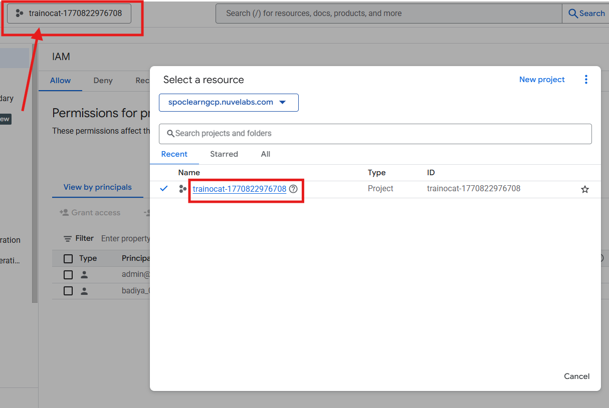

3. **Open Terminal from the VM:** Navigate to Compute Engine → VM instances in the Cloud Console. Locate the VM instance provided for this lab and click the **SSH** button to connect. Alternatively, if accessing a desktop VM, click the Terminal Emulator icon on the desktop.


### Step 2: Auth Login and Set Project ID

**Why are we doing this?** The `gcloud` CLI needs to authenticate with your Google account and target the correct project.

1. From the terminal, authenticate to Google Cloud:

   ```bash
   gcloud auth login
   ```

   _(This opens a browser window. Sign in with your Google account and click Continue → Allow)._

2. Set the active project variables:

   ```bash
   # Replace 'your-project-id' with your actual Project ID
   export PROJECT_ID="your-project-id"
   export GOOGLE_CLOUD_PROJECT=$PROJECT_ID
   gcloud config set project $PROJECT_ID
   ```

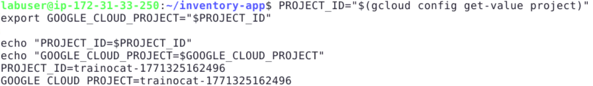

3. Verify configuration:
   ```bash
   gcloud config list
   ```

### Step 3: Enable Required APIs

**Why are we doing this?** Each GCP service has an API that must be explicitly enabled before you can create resources.

1. Enable the services:

   ```bash
   gcloud services enable \
     compute.googleapis.com \
     container.googleapis.com \
     run.googleapis.com \
     cloudbuild.googleapis.com \
     artifactregistry.googleapis.com \
     sqladmin.googleapis.com
   ```

   _(Wait 30–60 seconds for APIs to fully activate)._

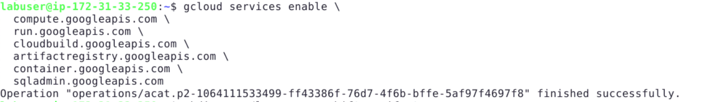

2. Verify they are enabled:
   ```bash
   gcloud services list --enabled | grep -E "compute|container|run|cloudbuild|artifactregistry|sqladmin"
   ```

---

## Part 1: Setting up the "Legacy" On-Premises Environment

**Objective:** Deploy a virtual machine acting as an on-premises server hosting a monolithic application and a PostgreSQL database, and create a legacy OpenShift manifest.

### Step 1: Provision the Legacy Server (App + Database)

1. Create the startup script locally to ensure correct syntax formatting:

   ```bash
   cat << 'EOF' > startup.sh
   #!/bin/bash
   apt-get update
   apt-get install -y postgresql
   sudo -u postgres psql -c "CREATE DATABASE inventory_db;"
   sudo -u postgres psql -d inventory_db -c "CREATE TABLE products (id serial PRIMARY KEY, name VARCHAR(50), qty INT);"
   sudo -u postgres psql -d inventory_db -c "INSERT INTO products (name, qty) VALUES ('Legacy Widget A', 100), ('Legacy Widget B', 50);"
   mkdir -p /var/www/inventory-app

   cat << 'APP' > /var/www/inventory-app/app.py
   from flask import Flask
   import os
   app = Flask(__name__)
   @app.route('/')
   def hello(): return 'Legacy Inventory System v1.0 - Running on VM'
   if __name__ == '__main__':
       app.run(host='0.0.0.0', port=8080)
   APP

   cat << 'REQ' > /var/www/inventory-app/requirements.txt
   Flask==2.1.0
   Werkzeug==2.2.2
   REQ
   EOF
   ```

2. Provision the VM using the file (using zone `b` to avoid quota limits):
   ```bash
   gcloud compute instances create legacy-inventory-server \
     --zone=us-central1-b \
     --machine-type=e2-medium \
     --image-family=debian-11 \
     --image-project=debian-cloud \
     --metadata-from-file=startup-script=startup.sh
   ```

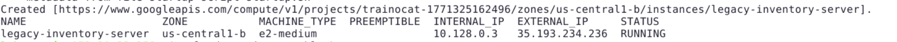

### Step 2: Create a Legacy OpenShift Manifest

1. Create a directory for the legacy files:
   ```bash
   mkdir -p ~/legacy-openshift-manifests
   ```
2. Create a legacy OpenShift `DeploymentConfig` file:
   ```bash
   cat << 'EOF' > ~/legacy-openshift-manifests/checkout-dc.yaml
   apiVersion: apps.openshift.io/v1
   kind: DeploymentConfig
   metadata:
     name: checkout-service
   spec:
     replicas: 2
     template:
       metadata:
         labels:
           app: checkout
       spec:
         containers:
         - name: checkout
           image: nginx:alpine
           ports:
           - containerPort: 80
   EOF
   ```

_(Wait 2-3 minutes for the VM startup script to finish installing PostgreSQL before moving to Part 2)._

---

## Part 2: VM to Cloud Run Migration (Replatforming)

**Objective:** Extract the legacy application from the VM, containerize it, and deploy it to a managed serverless platform.

### Step 1: Extract the Application

1. Copy the application folder from the legacy VM to your local workspace using SCP.
   **IMPORTANT:** When you run this command, if prompted `Are you sure you want to continue connecting (yes/no)?`, type **Y** and press **Enter**. When prompted for a passphrase, leave it empty and press **Enter twice**.

   ```bash
   gcloud compute scp legacy-inventory-server:/var/www/inventory-app ~/ \
     --zone=us-central1-b \
     --recurse
   ```

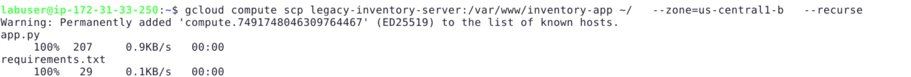

2. Navigate into the application directory:
   ```bash
   cd ~/inventory-app
   ```

### Step 2: Update the App for Cloud Run & Containerize

Cloud Run requires applications to bind dynamically to a `PORT` environment variable.

1. Overwrite the legacy `app.py` with the updated Cloud Run code:

   ```bash
   cat << 'EOF' > ~/inventory-app/app.py
   from flask import Flask
   import os

   app = Flask(__name__)

   @app.route('/')
   def hello():
       return 'Legacy Inventory System v1.0 - Migrated to Cloud Run!'

   if __name__ == '__main__':
       port = int(os.environ.get('PORT', 8080))
       app.run(host='0.0.0.0', port=port)
   EOF
   ```

2. Create the `Dockerfile`:
   ```bash
   cat << 'EOF' > Dockerfile
   FROM python:3.9-slim
   WORKDIR /app
   COPY requirements.txt .
   RUN pip install -r requirements.txt
   COPY . .
   CMD ["python", "app.py"]
   EOF
   ```

### Step 3: Grant Required Service Account Permissions

Cloud Build requires permission to push container images and write logs. We grant these permissions to the default Compute Engine service account used by the lab environment.

1. Run this block of code in your terminal:

   ```bash
   export PROJECT_NUMBER=$(gcloud projects describe $PROJECT_ID --format='value(projectNumber)')
   export COMPUTE_SA="${PROJECT_NUMBER}-compute@developer.gserviceaccount.com"

   gcloud projects add-iam-policy-binding $PROJECT_ID \
     --member="serviceAccount:$COMPUTE_SA" \
     --role="roles/storage.admin"

   gcloud projects add-iam-policy-binding $PROJECT_ID \
     --member="serviceAccount:$COMPUTE_SA" \
     --role="roles/logging.logWriter"

   gcloud projects add-iam-policy-binding $PROJECT_ID \
     --member="serviceAccount:$COMPUTE_SA" \
     --role="roles/artifactregistry.createOnPushWriter"
   ```

   _(Wait 15 seconds for the IAM permissions to propagate)._

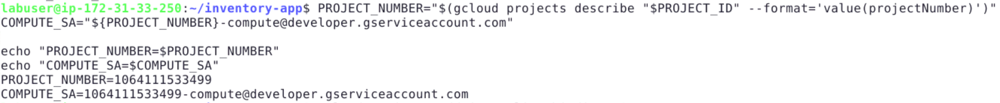

### Step 4: Deploy to Cloud Run

1. Build the container image in Google Cloud Build:
   ```bash
   gcloud builds submit --tag gcr.io/$GOOGLE_CLOUD_PROJECT/migrated-inventory-app
   ```

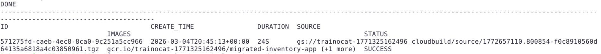

2. Deploy the application to Cloud Run:
   ```bash
   gcloud run deploy migrated-inventory-app \
     --image gcr.io/$GOOGLE_CLOUD_PROJECT/migrated-inventory-app \
     --region us-central1 \
     --platform managed \
     --allow-unauthenticated
   ```

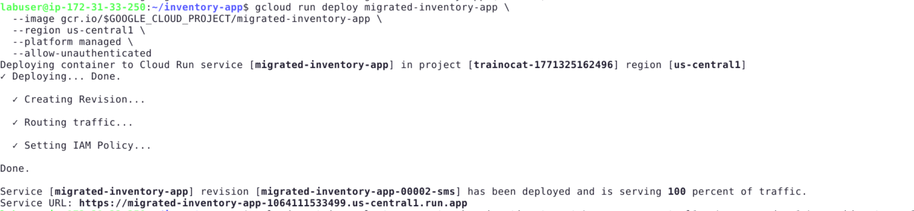

---

## Part 3: OpenShift to GKE Migration

**Objective:** Migrate the OpenShift container workload to standard Google Kubernetes Engine.

### Step 1: Install Dependencies & Provision GKE

1. Install `kubectl` and the GKE Auth Plugin via the `apt-get` package manager to ensure compatibility:
   ```bash
   sudo apt-get update
   sudo apt-get install google-cloud-sdk-gke-gcloud-auth-plugin kubectl -y
   ```
2. Create the target cluster (This takes ~5-8 minutes):
   ```bash
   gcloud container clusters create gke-migration-target \
     --zone us-central1-b \
     --num-nodes 1 \
     --machine-type=e2-small
   ```

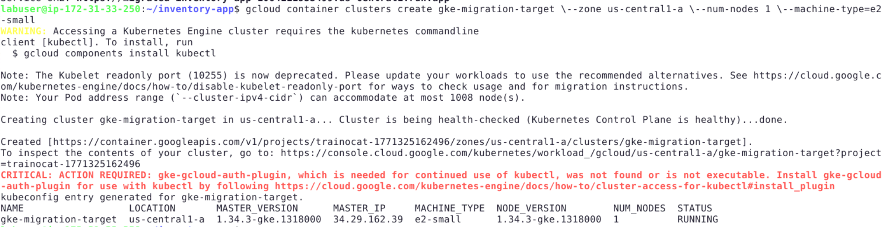

3. Fetch the cluster credentials:

   ```bash
   gcloud container clusters get-credentials gke-migration-target --zone us-central1-b
   ```

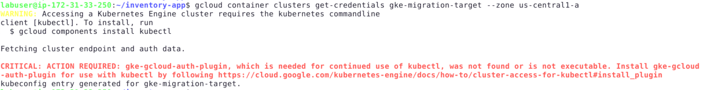

### Step 2: Refactor and Deploy the Workload

1. Convert the legacy OpenShift manifest into a standard Kubernetes `Deployment`. Run this exact block to ensure correct YAML indentation:
   ```bash
   cat > ~/checkout-gke-deployment.yaml << 'EOF'
   apiVersion: apps/v1
   kind: Deployment
   metadata:
     name: checkout-microservice
   spec:
     replicas: 2
     selector:
       matchLabels:
         app: checkout
     template:
       metadata:
         labels:
           app: checkout
       spec:
         containers:
         - name: checkout
           image: nginx:alpine
           ports:
           - containerPort: 80
   EOF
   ```
2. Deploy it to GKE:
   ```bash
   kubectl apply -f ~/checkout-gke-deployment.yaml
   ```
   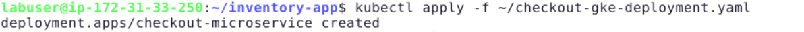

---

## Part 4: Database Migration Execution

**Objective:** Provision Cloud SQL and migrate the data from the legacy VM's PostgreSQL database.

### Step 1: Provision Cloud SQL Target

1. Create the Cloud SQL PostgreSQL instance (This takes ~7-10 minutes):

   ```bash
   gcloud sql instances create target-postgres-db \
     --database-version=POSTGRES_14 \
     --cpu=1 \
     --memory=3840MB \
     --region=us-central1 \
     --root-password="supersecretpassword"
   ```

   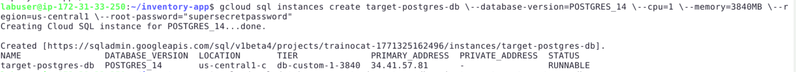

2. Create the target database inside the instance:

   ```bash
   gcloud sql databases create inventory_db --instance=target-postgres-db
   ```

   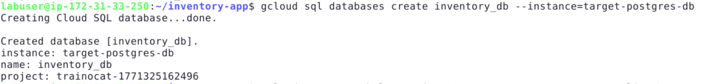

### Step 2: Extract Data from Legacy Database

Because Cloud SQL restricts superuser privileges, the export must omit strict ownership commands.

1. SSH into the legacy VM and generate a clean SQL dump using the `--no-owner` and `--no-acl` flags:

   ```bash
   gcloud compute ssh legacy-inventory-server --zone=us-central1-b \
     --command="sudo -u postgres pg_dump -Fp --no-owner --no-acl inventory_db > /tmp/inventory_dump_clean.sql"
   ```

   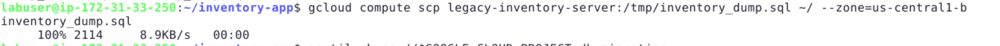

2. Download the dump file to your local lab terminal:
   ```bash
   gcloud compute scp legacy-inventory-server:/tmp/inventory_dump_clean.sql ~/ --zone=us-central1-b
   ```

### Step 3: Import Data to Cloud SQL Target

Cloud SQL imports must come from a Cloud Storage bucket, because it cannot import directly from your local terminal files. Therefore, we first upload the dump file to a bucket before importing.

1. Create a Cloud Storage bucket and upload the SQL dump:

   ```bash
   gsutil mb gs://$GOOGLE_CLOUD_PROJECT-db-migration
   gsutil cp ~/inventory_dump_clean.sql gs://$GOOGLE_CLOUD_PROJECT-db-migration/
   ```

   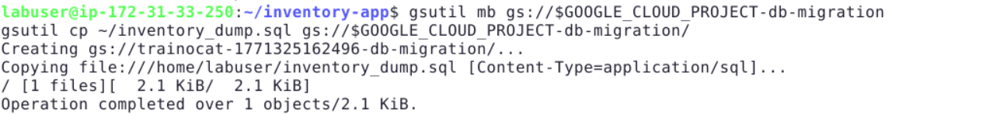

2. Grant the Cloud SQL service account access to read the bucket:
   ```bash
   SQL_SA=$(gcloud sql instances describe target-postgres-db --format="value(serviceAccountEmailAddress)")
   gsutil iam ch serviceAccount:$SQL_SA:objectViewer gs://$GOOGLE_CLOUD_PROJECT-db-migration
   ```
3. Import the database dump into Cloud SQL:

   ```bash
   gcloud sql import sql target-postgres-db gs://$GOOGLE_CLOUD_PROJECT-db-migration/inventory_dump_clean.sql \
     --database=inventory_db --quiet
   ```

   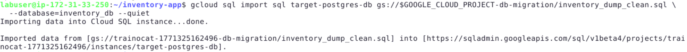

---

## Part 5: Daily Capstone - Migration Wave Plan

**Objective:** Document your migration logic, roadmaps, and rollback strategies.

1. Navigate to your home directory:
   ```bash
   cd ~
   ```
2. Create your Capstone Markdown document:

   ```bash
   cat << 'EOF' > Migration-Wave-Plan.md
   # Enterprise Migration Wave Plan

   ## 1. Migration Strategies Assessed
   * **Inventory App:** Replatformed from VM to Cloud Run to leverage serverless scale.
   * **Checkout Service:** Replatformed from OpenShift to GKE by standardizing manifests.
   * **Database:** Migrated via logical dump/restore to managed Cloud SQL.

   ## 2. Wave 1: Legacy VM to GCP Roadmap
   * Code extracted via SCP.
   * Dockerfile created to containerize Python Flask application.
   * Deployed via Cloud Build and Cloud Run.

   ## 3. Wave 2: OpenShift to GKE Roadmap
   * GKE Cluster Provisioned.
   * OpenShift `DeploymentConfig` rewritten as standard K8s `Deployment`.
   * Applied via kubectl.

   ## 4. Rollback & Risk Strategy
   * **Risk:** Data loss during PostgreSQL migration.
   * **Mitigation:** Use Database Migration Service (DMS) for continuous replication in production.
   * **Rollback:** Retain the `legacy-inventory-server` VM in a stopped state. If Cloud Run fails, update DNS to point back to the legacy VM IP address.
   EOF
   ```

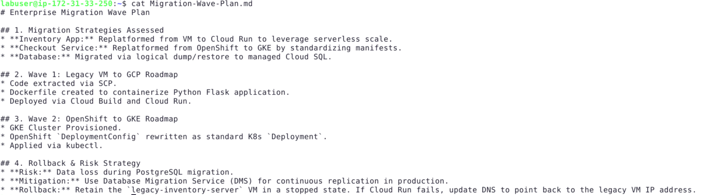

---

# Conclusion

In this guided project, you migrated a legacy enterprise application to modern Google Cloud platforms. You deployed workloads on **Cloud Run and GKE**, migrated a **PostgreSQL database to Cloud SQL**, and created a **migration wave plan** to guide enterprise modernization.
